<!-- game film: the shot goes in every time. -->

  

  <code>issue</code> → shoot your shot → <code>pull request</code> → nothing but net → <code>merged</code>

| PLAYER | MIN | ISSUES PICKED | SHOTS (PRs) | MERGES | FG% |
|:------:|:---:|:-------------:|:-----------:|:------:|:---:|
| tamayaz | ∞ | every&nbsp;one | all&nbsp;of&nbsp;them | all&nbsp;of&nbsp;them | 100 |

