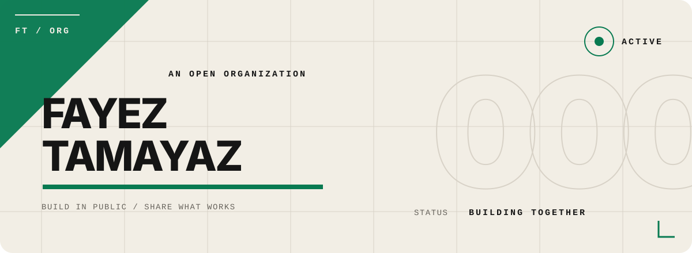

<p align="center">
  
</p>

<br />

```text
ISSUE       000
SUBJECT     FAYEZ TAMAYAZ
STATE       OPEN
QUESTION    WHAT IS WORTH MAKING NEXT?
```

## Premise

A profile should leave evidence, not make claims.

This one begins deliberately unfinished. The work gets the final word; this page simply keeps the door open.

## Working method

```text
01  NOTICE    find the detail that changes the problem
02  REDUCE    remove whatever hides the intent
03  MAKE      give the idea a form someone can use
04  RETURN    refine it after the first answer feels finished
```

## Review before merge

- Does it make the idea clearer?
- Is the complexity earning its place?
- Can another person pick it up and continue?
- Is it worth signing my name to?

## Evidence

The repositories are the record: experiments, useful fragments, finished things, and the distance between them.

**[Open the repository index →](https://github.com/fayeztamayaz?tab=repositories)**

## Open thread

If something here intersects with something you are making, that is enough of a reason to start a conversation.

<br />

<p align="right">
  <sub>ISSUE 000 REMAINS OPEN · THE NEXT COMMIT CONTINUES IT</sub>
</p>
